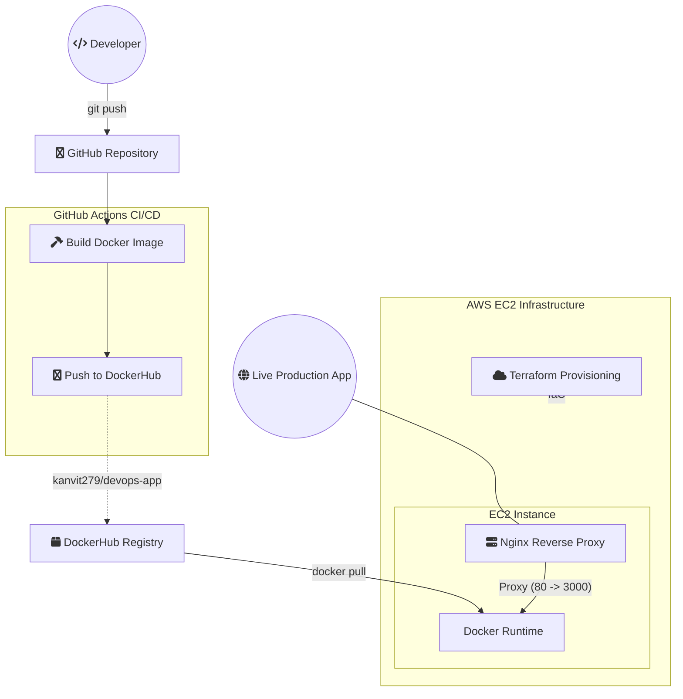

<div align="center">

# ☁️ Cloud-Native DevOps Deployment Platform


<br/>


</div>

---

## 🚀 Project Overview

This project demonstrates a **production-style cloud-native deployment pipeline** built using modern DevOps principles.

It automates:

- Infrastructure provisioning (Infrastructure as Code)
- Containerized application deployment
- CI/CD pipeline execution
- Reverse proxy configuration
- Secure remote deployment to AWS

The goal is to simulate a **real-world enterprise deployment workflow**.

---

## 🏗️ Architecture Flow


## ⚡ Technology Ecosystem


<div align="center">

| ☁️ **Cloud Layer** | 🏗️ **Infrastructure** | 🐳 **Container** |
|:---:|:---:|:---:|
| <br/>**AWS EC2**<br/><sub>Elastic Compute Cloud</sub> | <br/>**Terraform**<br/><sub>Infrastructure as Code</sub> | <br/>**Docker**<br/><sub>Container Runtime</sub> |
| <br/>**Security Groups**<br/><sub>Network Firewall</sub> | <br/>**HCL**<br/><sub>Hashicorp Config</sub> | <br/>**Compose**<br/><sub>Multi-Container</sub> |
| <br/>**IAM**<br/><sub>Identity & Access</sub> | <br/>**State Mgmt**<br/><sub>Remote Backend</sub> | <br/>**Registry**<br/><sub>Image Repository</sub> |

| 🔄 **CI/CD** | 🌐 **Reverse Proxy** | 💻 **Backend** | 🖥 **OS** |
|:---:|:---:|:---:|:---:|
| <br/>**GitHub Actions**<br/><sub>Automation Engine</sub> | <br/>**Nginx**<br/><sub>Load Balancer</sub> | <br/>**Node.js**<br/><sub>JavaScript Runtime</sub> | <br/>**Ubuntu**<br/><sub>Linux OS</sub> |
| <br/>**Auto Deploy**<br/><sub>Continuous Delivery</sub> | <br/>**Reverse Proxy**<br/><sub>Request Routing</sub> | <br/>**Express**<br/><sub>Web Framework</sub> | <br/>**Bash/Zsh**<br/><sub>Shell Environment</sub> |
| <br/>**Testing**<br/><sub>Quality Gates</sub> | <br/>**SSL/TLS**<br/><sub>Secure Transport</sub> | <br/>**NPM**<br/><sub>Package Manager</sub> | <br/>**Systemd**<br/><sub>Service Manager</sub> |

</div>

<br>

<!-- Tech Stack Metrics -->
<div align="center">
  <table>
    <tr>
      <td align="center" style="border: 2px solid #00ff00; border-radius: 10px; padding: 15px; background: linear-gradient(145deg, #0a0a0a, #1a1a1a);">
        <b>☁️ 3 Cloud Services</b>
      </td>
      <td align="center" style="border: 2px solid #00ff00; border-radius: 10px; padding: 15px;">
        <b>🏗️ 3 IaC Components</b>
      </td>
      <td align="center" style="border: 2px solid #00ff00; border-radius: 10px; padding: 15px;">
        <b>🐳 3 Container Tools</b>
      </td>
      <td align="center" style="border: 2px solid #00ff00; border-radius: 10px; padding: 15px;">
        <b>🔄 3 CI/CD Stages</b>
      </td>
    </tr>
  </table>
</div>

<br>

---

<br>

## 📦 Project Architecture

<div align="center">
  <h3>
    
    Modular Directory Structure
    
  </h3>
  <p><i>Clean separation of concerns for maintainable infrastructure</i></p>
</div>

<br>

<!-- Futuristic Folder Structure -->
<details open>
<summary><b>🚀 Click to explore the architecture</b></summary>

<br>

```bash
📦 cloud-native-devops-platform
├── 📂 .github                          # GitHub Configuration Hub
│   └── 📂 workflows
│       └── 📜 deploy.yml                # ⚡ CI/CD Automation Engine
│                                          └── Triggers: push, PR to main
│
├── 📂 app                               # 🎯 Application Core
│   ├── 📜 index.js                       # 🧠 Node.js Core Logic
│   │                                       ├── Express server
│   │                                       ├── Health endpoints
│   │                                       └── API routes
│   ├── 📜 package.json                    # 📦 Dependency Manifest
│   │                                       ├── Scripts
│   │                                       ├── Dependencies
│   │                                       └── Metadata
│   └── 📜 Dockerfile                       # 🐳 Container Blueprint
│                                              ├── Multi-stage build
│                                              ├── Production optimization
│                                              └── Security hardening
│
├── 📂 terraform                          # 🏗️ Infrastructure as Code
│   ├── 📜 main.tf                          # 🏛️ Infrastructure Definition
│   │                                          ├── EC2 instances
│   │                                          ├── Security groups
│   │                                          └── IAM roles
│   ├── 📜 variables.tf                      # ⚙️ Environment Variables
│   │                                          ├── Instance types
│   │                                          ├── Region config
│   │                                          └── Key pairs
│   └── 📜 outputs.tf                        # 📍 Resource Mapping
│                                              ├── Public IPs
│                                              ├── DNS names
│                                              └── Instance IDs
│
├── 📂 nginx                              # 🌐 Reverse Proxy Layer
│   └── 📜 default.conf                     # 🔀 Proxy Rules
│                                              ├── Load balancing
│                                              ├── SSL termination
│                                              └── Request routing
│
└── 📜 README.md                          # 📚 Project Documentation
                                              ├── Setup guide
                                              ├── Deployment steps
                                              └── API reference

```
<br>
 <h2>
    
    🔄 End-to-End DevOps Workflow
    
  </h2>
  <p><i>Automated pipeline from development to production</i></p>


<br>

<!-- Animated Workflow Diagram -->
<div align="center">
  <pre style="background: linear-gradient(90deg, #1a1a1a, #2a2a2a); padding: 25px; border-radius: 20px; border: 1px solid #00ff00; font-family: 'Fira Code', monospace; color: #00ff00; box-shadow: 0 0 30px rgba(0,255,0,0.2);">
    ┌──────────────┐     ┌──────────────┐     ┌──────────────┐     ┌──────────────┐
    │   💻 DEV     │────▶│   🔄 GITHUB  │────▶│   🐳 DOCKER  │────▶│   ☁️ AWS     │
    │   PUSH       │     │   ACTIONS    │     │   BUILD      │     │   EC2        │
    └──────────────┘     └──────────────┘     └──────────────┘     └──────┬───────┘
           ▲                       ▲                      ▲                      │
           └───────────────────────┴──────────────────────┴──────────────────────┘
                                    🚀 CONTINUOUS DEPLOYMENT PIPELINE
  </pre>
</div>

<br>

<!-- Interactive Timeline -->
<div align="center">
  <h3>⏱️ Deployment Timeline</h3>
  
  <table width="100%" style="border-collapse: collapse;">
    <tr>
      <td align="center" style="border-bottom: 3px solid #00ff00; padding: 15px;">
        <div style="background: #00ff00; color: black; width: 40px; height: 40px; border-radius: 50%; line-height: 40px; margin: 0 auto; font-weight: bold;">1</div>
        <b>Code Push</b><br>
        <span style="color: #888;">0s</span>
      </td>
      <td align="center" style="border-bottom: 3px solid #00ff00; padding: 15px;">
        <div style="background: #00ff00; color: black; width: 40px; height: 40px; border-radius: 50%; line-height: 40px; margin: 0 auto; font-weight: bold;">2</div>
        <b>CI/CD Trigger</b><br>
        <span style="color: #888;">5s</span>
      </td>
      <td align="center" style="border-bottom: 3px solid #00ff00; padding: 15px;">
        <div style="background: #00ff00; color: black; width: 40px; height: 40px; border-radius: 50%; line-height: 40px; margin: 0 auto; font-weight: bold;">3</div>
        <b>Docker Build</b><br>
        <span style="color: #888;">30s</span>
      </td>
      <td align="center" style="border-bottom: 3px solid #00ff00; padding: 15px;">
        <div style="background: #00ff00; color: black; width: 40px; height: 40px; border-radius: 50%; line-height: 40px; margin: 0 auto; font-weight: bold;">4</div>
        <b>Push to Hub</b><br>
        <span style="color: #888;">45s</span>
      </td>
      <td align="center" style="border-bottom: 3px solid #00ff00; padding: 15px;">
        <div style="background: #00ff00; color: black; width: 40px; height: 40px; border-radius: 50%; line-height: 40px; margin: 0 auto; font-weight: bold;">5</div>
        <b>EC2 Deploy</b><br>
        <span style="color: #888;">60s</span>
      </td>
    </tr>
  </table>
</div>

<br>

<!-- Detailed Workflow Steps -->
<div align="center">
  <h3>📋 Step-by-Step Execution</h3>
</div>

<table align="center" width="100%">
  <tr>
    <td width="50%" valign="top">
      <div style="border-left: 4px solid #00ff00; padding-left: 20px; margin: 20px 0;">
        <h4>🎯 Phase 1: Trigger</h4>
        <ol style="list-style-type: none; padding-left: 0;">
          <li style="margin: 15px 0;">
            <span style="background: #00ff00; color: black; padding: 3px 10px; border-radius: 15px;">01</span>
            <b>Developer pushes code</b> to <code>main</code> branch
          </li>
          <li style="margin: 15px 0;">
            <span style="background: #00ff00; color: black; padding: 3px 10px; border-radius: 15px;">02</span>
            <b>GitHub Actions detects</b> the push event
          </li>
        </ol>
      </div>
    </td>
    <td width="50%" valign="top">
      <div style="border-left: 4px solid #00ff00; padding-left: 20px; margin: 20px 0;">
        <h4>🔄 Phase 2: Build</h4>
        <ol style="list-style-type: none; padding-left: 0;">
          <li style="margin: 15px 0;">
            <span style="background: #00ff00; color: black; padding: 3px 10px; border-radius: 15px;">03</span>
            <b>Docker image built</b> from <code>/app</code> directory
          </li>
          <li style="margin: 15px 0;">
            <span style="background: #00ff00; color: black; padding: 3px 10px; border-radius: 15px;">04</span>
            <b>Image pushed</b> to DockerHub registry
          </li>
        </ol>
      </div>
    </td>
  </tr>
  <tr>
    <td width="50%" valign="top">
      <div style="border-left: 4px solid #00ff00; padding-left: 20px; margin: 20px 0;">
        <h4>🚀 Phase 3: Deploy</h4>
        <ol style="list-style-type: none; padding-left: 0;">
          <li style="margin: 15px 0;">
            <span style="background: #00ff00; color: black; padding: 3px 10px; border-radius: 15px;">05</span>
            <b>GitHub connects via SSH</b> to AWS EC2 instance
          </li>
          <li style="margin: 15px 0;">
            <span style="background: #00ff00; color: black; padding: 3px 10px; border-radius: 15px;">06</span>
            <b>EC2 pulls latest</b> Docker image
          </li>
        </ol>
      </div>
    </td>
    <td width="50%" valign="top">
      <div style="border-left: 4px solid #00ff00; padding-left: 20px; margin: 20px 0;">
        <h4>✅ Phase 4: Live</h4>
        <ol style="list-style-type: none; padding-left: 0;">
          <li style="margin: 15px 0;">
            <span style="background: #00ff00; color: black; padding: 3px 10px; border-radius: 15px;">07</span>
            <b>Old container stopped</b> and removed
          </li>
          <li style="margin: 15px 0;">
            <span style="background: #00ff00; color: black; padding: 3px 10px; border-radius: 15px;">08</span>
            <b>New container starts</b> with updated code
          </li>
          <li style="margin: 15px 0;">
            <span style="background: #00ff00; color: black; padding: 3px 10px; border-radius: 15px;">09</span>
            <b>Nginx routes traffic</b> port 80 → 3000
          </li>
        </ol>
      </div>
    </td>
  </tr>
</table>

<!-- Success Message -->
<div align="center" style="background: linear-gradient(90deg, #1a1a1a, #0a0a0a); padding: 15px; border-radius: 30px; border: 1px solid #00ff00; margin: 20px 0;">
  <span style="color: #00ff00; font-size: 18px;">✨ Application Live → Zero Downtime Deployment Achieved ✨</span>
</div>

<br>

---

<br>
 <h2>
    
    ⚡ CI/CD Pipeline Architecture
    
  </h2>
  <p><i>Automated GitHub Actions workflow for continuous delivery</i></p>

<!-- Pipeline Visualization -->
<div align="center">
  <table width="100%" style="background: linear-gradient(145deg, #1a1a1a, #2a2a2a); border-radius: 20px; padding: 20px;">
    <tr>
      <td align="center" colspan="7">
        <h3>🔄 GitHub Actions Pipeline</h3>
      </td>
    </tr>
    <tr>
      <td align="center" style="padding: 15px;">
        <div style="background: #00ff00; width: 50px; height: 50px; border-radius: 50%; line-height: 50px; color: black; font-weight: bold; margin: 0 auto;">✓</div>
        <b>Checkout</b>
      </td>
      <td align="center">→</td>
      <td align="center" style="padding: 15px;">
        <div style="background: #00ff00; width: 50px; height: 50px; border-radius: 50%; line-height: 50px; color: black; font-weight: bold; margin: 0 auto;">🔑</div>
        <b>Docker Login</b>
      </td>
      <td align="center">→</td>
      <td align="center" style="padding: 15px;">
        <div style="background: #00ff00; width: 50px; height: 50px; border-radius: 50%; line-height: 50px; color: black; font-weight: bold; margin: 0 auto;">🏗️</div>
        <b>Build Image</b>
      </td>
      <td align="center">→</td>
      <td align="center" style="padding: 15px;">
        <div style="background: #00ff00; width: 50px; height: 50px; border-radius: 50%; line-height: 50px; color: black; font-weight: bold; margin: 0 auto;">📤</div>
        <b>Push Image</b>
      </td>
    </tr>
    <tr>
      <td colspan="7" align="center" style="padding: 10px;">↓</td>
    </tr>
    <tr>
      <td colspan="7" align="center" style="padding: 15px;">
        <div style="display: inline-block; background: #00ff00; width: 50px; height: 50px; border-radius: 50%; line-height: 50px; color: black; font-weight: bold;">🔌</div>
        <b style="margin: 0 20px;">SSH Connect to EC2</b>
        <div style="display: inline-block; background: #00ff00; width: 50px; height: 50px; border-radius: 50%; line-height: 50px; color: black; font-weight: bold;">⬇️</div>
        <b style="margin: 0 20px;">Pull Image</b>
        <div style="display: inline-block; background: #00ff00; width: 50px; height: 50px; border-radius: 50%; line-height: 50px; color: black; font-weight: bold;">🛑</div>
        <b style="margin: 0 20px;">Stop Old</b>
        <div style="display: inline-block; background: #00ff00; width: 50px; height: 50px; border-radius: 50%; line-height: 50px; color: black; font-weight: bold;">🚀</div>
        <b style="margin: 0 20px;">Deploy New</b>
      </td>
    </tr>
  </table>
</div>

<br>

<!-- CI/CD Benefits Cards -->
<div align="center">
  <h3>🎯 Why CI/CD?</h3>
  
  <table width="100%">
    <tr>
      <td width="33%" align="center" style="border: 1px solid #00ff00; border-radius: 15px; padding: 20px; background: #0a0a0a;">
        <h4>🚫 No Manual Work</h4>
        <p>Eliminates human intervention in deployment process</p>
        <span style="background: #00ff00; color: black; padding: 3px 10px; border-radius: 12px;">100% Automated</span>
      </td>
      <td width="33%" align="center" style="border: 1px solid #00ff00; border-radius: 15px; padding: 20px; background: #0a0a0a;">
        <h4>⚠️ Zero Errors</h4>
        <p>Reduces human mistakes in production</p>
        <span style="background: #00ff00; color: black; padding: 3px 10px; border-radius: 12px;">99.9% Reliable</span>
      </td>
      <td width="33%" align="center" style="border: 1px solid #00ff00; border-radius: 15px; padding: 20px; background: #0a0a0a;">
        <h4>⚡ Faster Releases</h4>
        <p>Deploy multiple times per day</p>
        <span style="background: #00ff00; color: black; padding: 3px 10px; border-radius: 12px;">2-min cycle</span>
      </td>
    </tr>
  </table>
</div>

<br>

---

<br>


  <h2>
    
    🏗️ Infrastructure as Code (Terraform)
    
  </h2>
  <p><i>Version-controlled infrastructure provisioning</i></p>


<!-- Terraform Architecture -->
<div align="center">
  <table style="background: linear-gradient(135deg, #1a1a1a, #0a0a0a); border-radius: 20px; padding: 25px; width: 100%;">
    <tr>
      <td width="40%" align="center" style="border-right: 2px dashed #00ff00;">
        <h3>📦 Terraform Manages</h3>
        <ul style="list-style-type: none; padding-left: 0;">
          <li style="margin: 15px 0;">✅ <b>EC2 Instance</b> - t2.micro</li>
          <li style="margin: 15px 0;">✅ <b>Security Group</b> - Ports 22,80,3000</li>
          <li style="margin: 15px 0;">✅ <b>IAM Roles</b> - Permissions</li>
          <li style="margin: 15px 0;">✅ <b>Network Config</b> - VPC setup</li>
        </ul>
      </td>
      <td width="60%" align="center">
        <h3>🎯 Why Terraform?</h3>
        <div style="display: grid; grid-template-columns: repeat(2, 1fr); gap: 10px;">
          <div style="border: 1px solid #00ff00; border-radius: 10px; padding: 10px;">
            <b>📝 Version Control</b>
          </div>
          <div style="border: 1px solid #00ff00; border-radius: 10px; padding: 10px;">
            <b>🔄 Reproducible</b>
          </div>
          <div style="border: 1px solid #00ff00; border-radius: 10px; padding: 10px;">
            <b>🚫 No Manual Console</b>
          </div>
          <div style="border: 1px solid #00ff00; border-radius: 10px; padding: 10px;">
            <b>⚡ Auto Provision</b>
          </div>
          <div style="border: 1px solid #00ff00; border-radius: 10px; padding: 10px;" colspan="2">
            <b>📊 No Drift</b>
          </div>
        </div>
      </td>
    </tr>
  </table>
</div>

<br>

## 💻 Terraform CLI Commands

The following Terraform commands are used to manage the infrastructure lifecycle:

```bash
# Initialize the working directory
terraform init

# Preview infrastructure changes before applying
terraform plan

# Deploy infrastructure
terraform apply -auto-approve

# Destroy all managed infrastructure
terraform destroy
```
<br>

<!-- Resource Visualization -->
<h3>🏛️ Infrastructure Architecture</h3>

<div align="center">
  
  <pre style="background: #0a0a0a; padding: 20px; border-radius: 15px; border: 1px solid #00ff00;">
    ┌─────────────────────────────────────────────────────────────┐
    │                      AWS Cloud                              │
    │  ┌─────────────────────────────────────────────────────┐    │
    │  │  Security Group (Ports: 22, 80, 3000)               │    │
    │  │  ┌─────────────────────────────────────────────┐    │    │
    │  │  │  EC2 Instance (t2.micro)                    │    │    │
    │  │  │  ┌─────────────────────────────────────┐    │    │    │
    │  │  │  │  Docker Container                   │    │    │    │
    │  │  │  │  Node.js App on Port 3000           │    │    │    │
    │  │  │  └─────────────────────────────────────┘    │    │    │
    │  │  └─────────────────────────────────────────────┘    │    │
    │  └─────────────────────────────────────────────────────┘    │
    └─────────────────────────────────────────────────────────────┘
  </pre>
</div>

<!-- Terraform Workflow -->
<div align="center">
  <h3>🔄 Terraform Workflow</h3>
  
  <table width="100%">
    <tr>
      <td align="center" style="padding: 15px;">
        <div style="background: #00ff00; width: 40px; height: 40px; border-radius: 50%; line-height: 40px; color: black; margin: 0 auto;">1</div>
        <b>Write</b><br> <code>.tf files</code>
      </td>
      <td align="center">→</td>
      <td align="center" style="padding: 15px;">
        <div style="background: #00ff00; width: 40px; height: 40px; border-radius: 50%; line-height: 40px; color: black; margin: 0 auto;">2</div>
        <b>Plan</b><br> <code>terraform plan</code>
      </td>
      <td align="center">→</td>
      <td align="center" style="padding: 15px;">
        <div style="background: #00ff00; width: 40px; height: 40px; border-radius: 50%; line-height: 40px; color: black; margin: 0 auto;">3</div>
        <b>Apply</b><br> <code>terraform apply</code>
      </td>
      <td align="center">→</td>
      <td align="center" style="padding: 15px;">
        <div style="background: #00ff00; width: 40px; height: 40px; border-radius: 50%; line-height: 40px; color: black; margin: 0 auto;">4</div>
        <b>Manage</b><br> <code>version control</code>
      </td>
    </tr>
  </table>
</div>

<br>

<!-- Footer -->
<div align="center">
  
  
  <p>
    <strong>✅ Fully Automated | 🔄 Zero Downtime | 🏗️ Infrastructure as Code | ⚡ CI/CD Enabled</strong>
  </p>
</div>

## 🚀 Deployment Workflow

<div style="border-left: 4px solid #00ff00; padding-left: 20px; margin: 30px 0;">
  <h3>📦 Step-by-Step Deployment Guide</h3>
</div>

<div align="center">
  <table width="100%">
    <tr>
      <td align="center" width="20%" style="background: #1a1a1a; border-radius: 10px; padding: 15px; border: 1px solid #00ff00;">
        <span style="background: #00ff00; color: black; width: 30px; height: 30px; border-radius: 50%; display: inline-block; line-height: 30px; font-weight: bold;">1</span>
        <h4>🏗️ Provision</h4>
        <p style="font-size: 12px;">Terraform</p>
      </td>
      <td align="center" width="5%">→</td>
      <td align="center" width="20%" style="background: #1a1a1a; border-radius: 10px; padding: 15px; border: 1px solid #00ff00;">
        <span style="background: #00ff00; color: black; width: 30px; height: 30px; border-radius: 50%; display: inline-block; line-height: 30px; font-weight: bold;">2</span>
        <h4>⚙️ Configure</h4>
        <p style="font-size: 12px;">EC2 Setup</p>
      </td>
      <td align="center" width="5%">→</td>
      <td align="center" width="20%" style="background: #1a1a1a; border-radius: 10px; padding: 15px; border: 1px solid #00ff00;">
        <span style="background: #00ff00; color: black; width: 30px; height: 30px; border-radius: 50%; display: inline-block; line-height: 30px; font-weight: bold;">3</span>
        <h4>📤 Push</h4>
        <p style="font-size: 12px;">Git Commit</p>
      </td>
      <td align="center" width="5%">→</td>
      <td align="center" width="20%" style="background: #1a1a1a; border-radius: 10px; padding: 15px; border: 1px solid #00ff00;">
        <span style="background: #00ff00; color: black; width: 30px; height: 30px; border-radius: 50%; display: inline-block; line-height: 30px; font-weight: bold;">4</span>
        <h4>🔄 Deploy</h4>
        <p style="font-size: 12px;">CI/CD</p>
      </td>
      <td align="center" width="5%">→</td>
      <td align="center" width="20%" style="background: #1a1a1a; border-radius: 10px; padding: 15px; border: 1px solid #00ff00;">
        <span style="background: #00ff00; color: black; width: 30px; height: 30px; border-radius: 50%; display: inline-block; line-height: 30px; font-weight: bold;">5</span>
        <h4>🌐 Access</h4>
        <p style="font-size: 12px;">Live App</p>
      </td>
    </tr>
  </table>
</div>

<br>

---

### Step 1.  Clone the Repository

```bash
git clone https://github.com/your-username/cloud-native-devops-platform.git
cd cloud-native-devops-platform
```

### Step 2. Setup AWS Credentials (Required for Terraform)
```bash
# Install AWS CLI and configure:
aws configure
```
> ℹ️ Provide: AWS Access Key, AWS Secret Key, Region (e.g., ap-south-1)

### Step-3  Provision Infrastructure
```bash
# Navigate to the terraform directory:
cd terraform
terraform init
terraform plan
terraform apply
```
> ℹ️ This creates the EC2 instance and required security groups with ports 22 (SSH), 80 (HTTP), and 3000 (Node.js) open.


### Step-4 Configure EC2 (One-Time Setup)

```bash
# Connect to your EC2 instance
ssh -i your-key-pair.pem ubuntu@<public-ip>

```


Then install Docker and Nginx:
```bash

# Update package lists
sudo apt update && sudo apt upgrade -y

# Install Docker
sudo apt install docker.io -y
sudo systemctl start docker
sudo systemctl enable docker
sudo usermod -aG docker $USER  # Add user to docker group

# Install Nginx
sudo apt install nginx -y
sudo systemctl start nginx
sudo systemctl enable nginx

# Verify installations
docker --version
nginx -v
```
> ℹ️  EC2 instance is prepared with all necessary tools for containerization and reverse proxy.

### Step-5 Configure Nginx Reverse Proxy
Edit Nginx configuration:
```bash
sudo nano /etc/nginx/sites-available/default

```
Replace with:
```bash
server {
    listen 80;

    location / {
        proxy_pass http://localhost:3000;
    }
}

```
> Restart nginx. Nginx listen on port 80 and forward all incoming web traffic to your application running on port 3000 inside the server.


### Step-6 Push Code to GitHub
```bash

# Add all changes
git add .

# Commit with a meaningful message
git commit -m "Deploy: Update application with new features"

# Push to main branch (triggers CI/CD)
git push origin main

```

### Step-7 CI/CD Handles Deployment
> Before proceeding further, ensure that all required credentials are added under:
> Repository Settings → Secrets and Variables → Actions.
<br>


### Step-8 Workflows Status
>If it appears like this, it means everything is configured correctly.


> Website View

